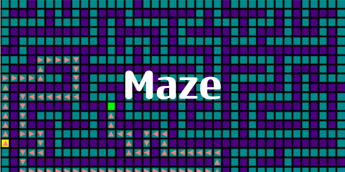

# Maze




## Setup

Clone the repository by 
```bash
git clone https://github.com/LeoDesh/Maze.git
```

## Configurations

In main.py you may directly run the script.

### Input Maze
```
maze = read_maze()
maze = create_maze()
```

Example mazes are located in maze/maze_examples

### Solve Maze
```
solve_maze(maze=maze)
```

### Plot Maze
```
plot_solution_path(maze)
plot_full_algorithm_path(maze)
```

## Requirements

- Python >= 3.7
- matplotlib==3.5.3
- pytest==7.4.4


## Implemented Algorithms:
- depth first search algorithm (DFS)
- breadth first search (BFS) 


## Contributing

Pull requests are welcome. In case you find anything to be not working as intented, let me know.